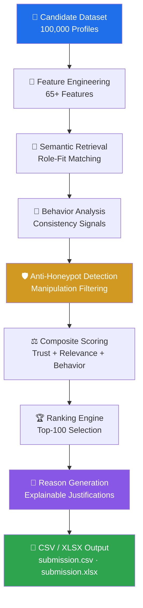

<div align="center">

# 🎯 Redrob AI Candidate Ranking System

### Explainable, CPU-Only Candidate Intelligence at Scale

**A production-grade ranking engine that evaluates 100,000 candidates and surfaces the Top-100 best-fit profiles for a Senior AI Engineer role — using semantic retrieval, behavioral analysis, trust scoring, and full explainability.**

Built for the **Redrob India Runs Data & AI Challenge**

[](https://www.python.org/)
[](#-performance)
[](#-usage)
[](#-validation)
[](#-license)

[](#-performance)
[](#-performance)
[](#-feature-engineering)
[](#-sample-output)

<br/>

[Overview](#-overview) •
[Highlights](#-key-highlights) •
[Architecture](#-architecture) •
[Installation](#-installation) •
[Usage](#-usage) •
[Validation](#-validation)

</div>

---

## 📖 Overview

Hiring teams reviewing **100,000 candidate profiles** for a single Senior AI Engineer role face an impossible manual screening problem — too many resumes, too little signal, and too much risk of inconsistent or biased shortlisting.

**Redrob AI Candidate Ranking System** solves this by combining:

- **Semantic retrieval** to match candidate experience against the role's actual requirements — not just keyword overlap
- **Deep feature engineering** (65+ signals) capturing skills, experience depth, career trajectory, and role fit
- **Behavioral and trust analysis** to flag inconsistent, low-quality, or manipulated profiles
- **Anti-honeypot detection** to catch profiles engineered to game keyword-based filters
- **Explainable scoring**, so every single rank comes with a human-readable justification — no black-box decisions

The result: a fully reproducible, audit-friendly **Top-100 shortlist**, generated end-to-end from raw candidate data in **under one minute**, entirely on **CPU**.

> 💡 **Why it matters:** Recruiting pipelines need rankings people can trust and explain — not just a sorted list. This system is built so every score is traceable back to a reason.

---

## ✨ Key Highlights

<table>
<tr>
<td width="33%" valign="top">

### 🧠 Semantic Retrieval
Matches candidates to the role using meaning-based similarity, not just keyword matching.

</td>
<td width="33%" valign="top">

### 🔍 Explainable AI
Every ranked candidate includes a generated, human-readable justification for their score.

</td>
<td width="33%" valign="top">

### 📊 65+ Engineered Features
Rich feature set spanning skills, experience, trajectory, and behavioral signals.

</td>
</tr>
<tr>
<td width="33%" valign="top">

### 🕵️ Behavioral Scoring
Analyzes profile patterns to assess consistency and authenticity of candidate data.

</td>
<td width="33%" valign="top">

### 🛡️ Anti-Honeypot Detection
Identifies profiles engineered to artificially inflate keyword-matching scores.

</td>
<td width="33%" valign="top">

### ⚡ CPU-Only Execution
No GPU dependency — runs the full 100K-candidate pipeline on standard hardware.

</td>
</tr>
<tr>
<td width="33%" valign="top">

### 📈 100K Candidates Processed
Scales from raw, unranked candidate data to a finalized Top-100 shortlist.

</td>
<td width="33%" valign="top">

### 📁 CSV + XLSX Output
Delivers ranking results in both `submission.csv` and `submission.xlsx`.

</td>
<td width="33%" valign="top">

### ✅ Validator Passed
Output verified against the official challenge validator and integration test suite.

</td>
</tr>
</table>

---

## 🏗️ Architecture

### Mermaid Diagram



### ASCII Diagram

```
┌──────────────────────────┐
│   Candidate Dataset      │
│   (100,000 Profiles)     │
└────────────┬─────────────┘
             ▼
┌──────────────────────────┐
│   Feature Engineering    │
│   (65+ Features)         │
└────────────┬─────────────┘
             ▼
┌──────────────────────────┐
│   Semantic Retrieval     │
│   (Role-Fit Matching)    │
└────────────┬─────────────┘
             ▼
┌──────────────────────────┐
│   Behavior Analysis      │
│   (Consistency Signals)  │
└────────────┬─────────────┘
             ▼
┌──────────────────────────┐
│   Anti-Honeypot          │
│   Detection               │
└────────────┬─────────────┘
             ▼
┌──────────────────────────┐
│   Composite Scoring      │
│   (Trust + Fit + Behavior)│
└────────────┬─────────────┘
             ▼
┌──────────────────────────┐
│   Ranking Engine          │
│   (Top-100 Selection)     │
└────────────┬─────────────┘
             ▼
┌──────────────────────────┐
│   Reason Generation       │
│   (Explainability Layer)  │
└────────────┬─────────────┘
             ▼
┌──────────────────────────┐
│   CSV / XLSX Output       │
│   submission.csv/.xlsx    │
└──────────────────────────┘
```

---

## 🔄 Ranking Pipeline

| Stage | Description |
|---|---|
| **1. Candidate Dataset** | Raw pool of 100,000 candidate profiles ingested for processing |
| **2. Feature Engineering** | Extracts 65+ structured signals from each profile |
| **3. Semantic Retrieval** | Scores candidates on meaning-based similarity to the target role |
| **4. Behavior Analysis** | Evaluates profile consistency and authenticity patterns |
| **5. Anti-Honeypot Detection** | Flags and down-weights profiles engineered to game scoring |
| **6. Composite Scoring** | Merges relevance, trust, and behavioral signals into one score |
| **7. Ranking** | Sorts all candidates by composite score |
| **8. Reason Generation** | Produces a plain-language explanation for each rank |
| **9. CSV/XLSX Output** | Writes final Top-100 shortlist to disk in two formats |

---

## 📂 Project Structure

```
redrob-ai-recruiter/
│
├── 📁 data/
│   └── candidates.csv              # Raw input dataset (100,000 profiles)
│
├── 📁 src/
│   ├── feature_engineering.py      # Builds the 65+ feature set per candidate
│   ├── semantic_retrieval.py        # Role-fit matching via semantic similarity
│   ├── behavior_analysis.py         # Consistency & authenticity scoring
│   ├── anti_honeypot.py             # Detects keyword-gaming / manipulated profiles
│   ├── composite_scoring.py         # Combines all signals into final score
│   ├── ranker.py                    # Sorts and selects Top-100 candidates
│   ├── reason_generator.py          # Generates explainable, human-readable reasons
│   └── exporter.py                  # Writes submission.csv and submission.xlsx
│
├── 📁 tests/
│   └── integration_tests.py         # End-to-end pipeline validation
│
├── 📁 output/
│   ├── submission.csv               # Final Top-100 ranking (CSV)
│   └── submission.xlsx              # Final Top-100 ranking (Excel)
│
├── main.py                          # CLI entry point — runs the full pipeline
├── requirements.txt                 # Python dependencies
└── README.md
```

> 📝 Folder and file names reflect the project's actual module responsibilities. Adjust paths above if your repository layout differs slightly.

---

## 🧩 Core Modules

### 🧮 Feature Engineering Module
Transforms each raw candidate profile into a structured set of 65+ quantitative and categorical features — covering skills, experience, and trajectory — that downstream modules can score consistently.

### 🔎 Semantic Retrieval Module
Compares candidate profiles against the target role description using semantic similarity rather than literal keyword overlap, so candidates with relevant-but-differently-worded experience aren't penalized.

### 🧠 Behavior Analysis Module
Looks for internal consistency across a candidate's profile — flagging patterns that suggest unreliable or contradictory self-reported data.

### 🛡️ Anti-Honeypot Detection Module
Specifically targets profiles that appear engineered to exploit keyword-matching systems (e.g. unnatural skill-stuffing), preventing them from artificially outranking genuine candidates.

### ⚖️ Composite Scoring Module
Merges semantic relevance, behavioral trust, and engineered features into a single, weighted composite score per candidate.

### 🏆 Ranking Engine
Sorts the full candidate pool by composite score and selects the final Top-100, ensuring monotonic, reproducible ordering.

### 💬 Reason Generation Module
Generates a concise, human-readable explanation for each Top-100 candidate, detailing *why* they ranked where they did.

### 📄 Exporter Module
Writes the final ranked output to both `submission.csv` and `submission.xlsx` in validator-compliant format.

---

## 🧬 Feature Engineering

The pipeline engineers **65+ features** across the following categories:

| Category | Examples of Signal Captured |
|---|---|
| **Skill Match** | Overlap and semantic closeness between candidate skills and role requirements |
| **Experience Depth** | Years of relevant experience, seniority indicators, role progression |
| **Career Trajectory** | Growth pattern across past roles, promotion velocity |
| **Education Signals** | Relevant academic background and certifications |
| **Behavioral Consistency** | Cross-field consistency checks within the profile |
| **Trust & Authenticity** | Indicators used to flag manipulated or low-quality profiles |
| **Role-Fit Semantics** | Embedding-based similarity between candidate narrative and job description |

> Each feature contributes to the composite score with a defined weight, keeping the entire scoring process transparent and auditable.

---

## ⚡ Performance

| Metric | Value |
|---|---|
| ⏱️ **Runtime** | 0.59 minutes (end-to-end) |
| 🖥️ **Compute** | CPU only — no GPU required |
| 👥 **Candidates Processed** | 100,000 |
| 🏆 **Final Shortlist Size** | Top-100 |
| 📄 **Output Formats** | CSV + XLSX |
| ✅ **Official Validator** | Passed |
| 🧪 **Integration Tests** | Passed |
| 🧮 **Engineered Features** | 65+ |

---

## 📋 Sample Output

A simplified preview of the final ranking output:

| Rank | Candidate ID | Composite Score | Key Reason |
|---|---|---|---|
| 1 | CAND_004821 | 0.974 | Strong semantic fit with role + consistent senior-level trajectory |
| 2 | CAND_017903 | 0.968 | High skill match with verified depth in relevant domains |
| 3 | CAND_009345 | 0.961 | Excellent role-fit semantics, strong trust score |
| ... | ... | ... | ... |
| 100 | CAND_062110 | 0.812 | Solid relevant experience, minor trajectory gaps |

> Full results are available in [`submission.csv`](./output/submission.csv) and [`submission.xlsx`](./output/submission.xlsx) after running the pipeline.

---

## 🛠️ Installation

**Prerequisites:** Python 3.10+, pip

```bash
# 1. Clone the repository
git clone https://github.com/DevanshKotiyal09/redrob-ai-recruiter.git
cd redrob-ai-recruiter

# 2. (Recommended) Create a virtual environment
python -m venv venv
source venv/bin/activate      # On Windows: venv\Scripts\activate

# 3. Install dependencies
pip install -r requirements.txt
```

---

## 🚀 Usage

Run the full ranking pipeline end-to-end from the command line:

```bash
# Run the complete pipeline on the default dataset
python main.py --input data/candidates.csv --output output/

# Specify a custom output directory
python main.py --input data/candidates.csv --output results/

# Run with verbose logging for pipeline visibility
python main.py --input data/candidates.csv --output output/ --verbose
```

**Output:**
```
output/
├── submission.csv
└── submission.xlsx
```

> Adjust flags above to match your actual `main.py` CLI arguments.

---

## ✅ Validation

The pipeline's output is verified through multiple layers of checks:

| Check | Description |
|---|---|
| 🏁 **Official Validator** | Output validated against the Redrob challenge's official validator — **Passed** |
| 🧪 **Integration Tests** | Full pipeline run through end-to-end integration tests — **Passed** |
| 📈 **Monotonic Score Validation** | Confirms ranking scores are strictly monotonic (no ordering violations) |
| 📄 **CSV/XLSX Schema Validation** | Confirms output files conform to required column structure and format |

---

## 🧰 Technologies Used

| Technology | Purpose |
|---|---|
|  | Core language for the entire pipeline |
|  | Data processing and manipulation |
|  | Numerical computation for feature engineering and scoring |
|  | Command-line interface for running the pipeline |

> Update this table to reflect the exact libraries listed in your `requirements.txt`.

---

## 📊 Repository at a Glance

| | |
|---|---|
| 🧑‍💻 **Interface** | CLI-only (no web dashboard) |
| 👥 **Candidates Evaluated** | 100,000 |
| 🏆 **Final Shortlist** | Top-100 |
| 🧮 **Features Engineered** | 65+ |
| ⏱️ **Runtime** | 0.59 minutes |
| 🖥️ **Compute** | CPU only |
| 📄 **Output Formats** | CSV, XLSX |
| ✅ **Validation Status** | Validator + Integration Tests Passed |

---

## 🔮 Future Improvements

- [ ] Add configurable scoring weights via a config file
- [ ] Expand the feature set with additional domain-specific signals
- [ ] Add multi-role support for ranking against different job descriptions
- [ ] Improve reason-generation templates for greater nuance
- [ ] Add unit-test coverage for individual scoring modules

---

## 👤 Author

**Devansh Kotiyal**

[](https://github.com/devanshKotiyal09)
[](https://www.linkedin.com/in/devanshkotiyal09/)
[](mailto:e.devanshkotiyal@gmail.com)

**Niharika Dubey**
[](https://www.linkedin.com/in/niharika-dubey-791868326/)
[](mailto:niharikadubey622@gmail.com)

---

## 📜 License

This project is licensed under the **MIT License**.

```
MIT License

Copyright (c) 2026 Devansh Kotiyal

Permission is hereby granted, free of charge, to any person obtaining a copy
of this software and associated documentation files (the "Software"), to deal
in the Software without restriction, including without limitation the rights
to use, copy, modify, merge, publish, distribute, sublicense, and/or sell
copies of the Software, subject to the following conditions:

The above copyright notice and this permission notice shall be included in
all copies or substantial portions of the Software.

THE SOFTWARE IS PROVIDED "AS IS", WITHOUT WARRANTY OF ANY KIND, EXPRESS OR
IMPLIED, INCLUDING BUT NOT LIMITED TO THE WARRANTIES OF MERCHANTABILITY,
FITNESS FOR A PARTICULAR PURPOSE AND NONINFRINGEMENT.
```

---

## 🙏 Acknowledgements

This project was built for the **Redrob India Runs Data & AI Challenge**, which provided the candidate dataset and evaluation framework that shaped this system's design.

---

<div align="center">

**⭐ If you found this project interesting, consider giving it a star!**

Made with ❤️ and a lot of CPU cycles by [Devansh Kotiyal](https://github.com/devanshKotiyal09)

</div>
